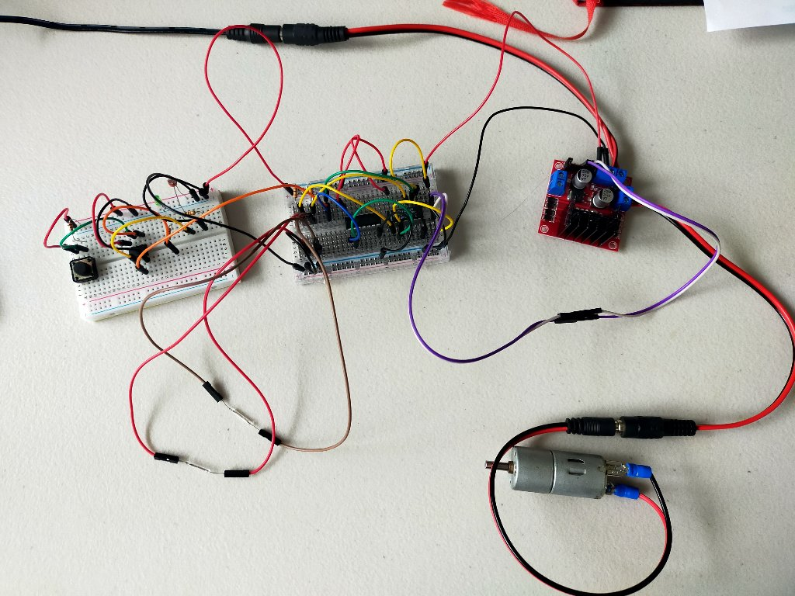
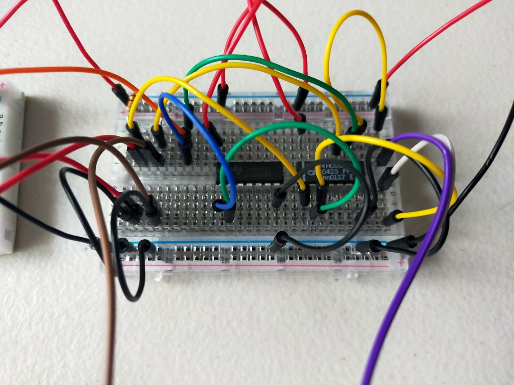
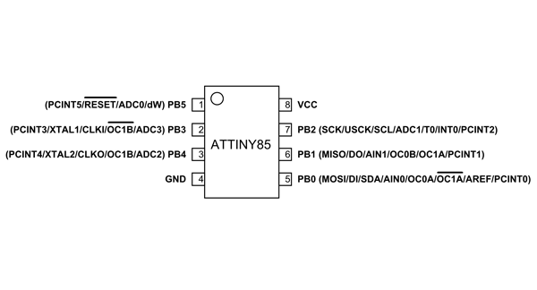
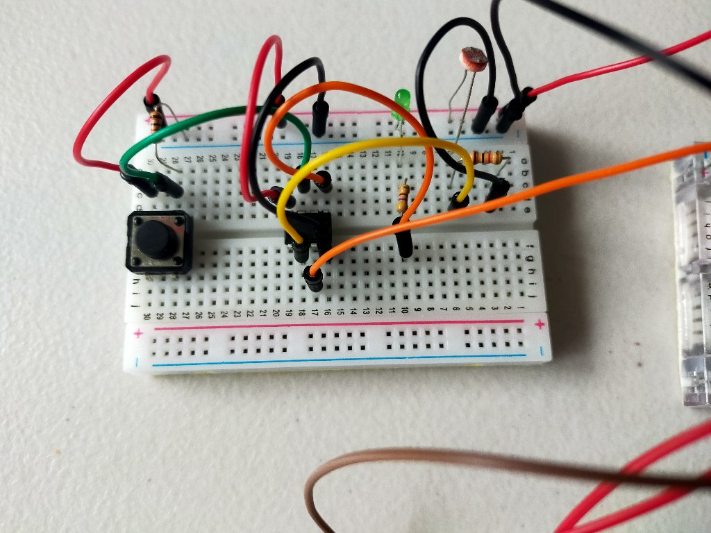

# Hen house door controller

## NOTE:

Set attiny clock speed to 1Mhz and re-burn the bootloader (Options on `Tools` menu of Arduino IDE).
Faster speeds mean the interrupt timer runs faster and screws up my timings.

## Requirement

* Minimal power consumption
* attiny85 at heart of it
* Everything controlled by interrupts
* Separate door control logic from compute (save on attiny85 outputs)
* Average light readings over 5min period
* Open door if light level above x
* Close door if light level below y (lower number than x)
* Button to override door open/closed and stop logic
 - Press 1) disable logic, swap door state
 - Press 2) enable logic, swap door state
* If door open, LED on
* Go to sleep when nothing is happening

## Components

* `attiny85` microcontroller dip
* Inverter logic dip `74HC04`
* AND logic dip `74HC08`
* Momentary push button
* LED
* LDR
* Magnetic reed switch (NO) x 2
* `L298n` motor controller
* 12v DC motor 2.1kg lift 70rpm
* Resistors (10k ohm x 4, 460 ohm x 1)
* Smallish breadboard x 2
* Lots of jumper cables

## Door Controller Logic Circuit

* One digital input at either high or low
* High means door should be open
* Low means door should be closed
* Two reed switches at top and bottom of door, using 10k ohm pullup resistors
* Magnet in door positioned so opposite reed switches when open / closed

### Logic

* If input is high and top reed is open, rotate upwards
* If input is low and bottom reed is open, rotate downwards
* All other states, motor off

[Circuit diagram for drawio](drawio/LogicController.drawio)

## Compute Module

### Wiring

#### Connections to attiny85

* Pin 8 (VCC) - 5v power
* Pin 7 (PB2, INT0) - Button output with 10k pulldown resistor
* Pin 5 (PB0) - LED with 460 ohm resistor (anything 300 - 1k, just changes brightness)
* Pin 4 (GND) - Ground
* Pin 2 (PB3, ADC3) - LDR with 10k ohm pulldown resistor

[Circuit diagram for drawio](drawio/LogicController.drawio)

### Logic

* Monitor LDR every 30s and store value in rotating array of 10 values, giving 5mins of values
* Check average of values every 5mins and set controller output to high or low
 - Value below x, set controller output low
 - Value above y, set controller output high
* Set LED to high / low, same as controller output
* Override button:
 - Press 1) disable logic, swap controller output
 - Press 2) enable logic, swap controller output

## Soon to come

* Send door opening / closing signal via 433Mhz transmitter
* Send state every 5mins via 433Mhz transmitter
